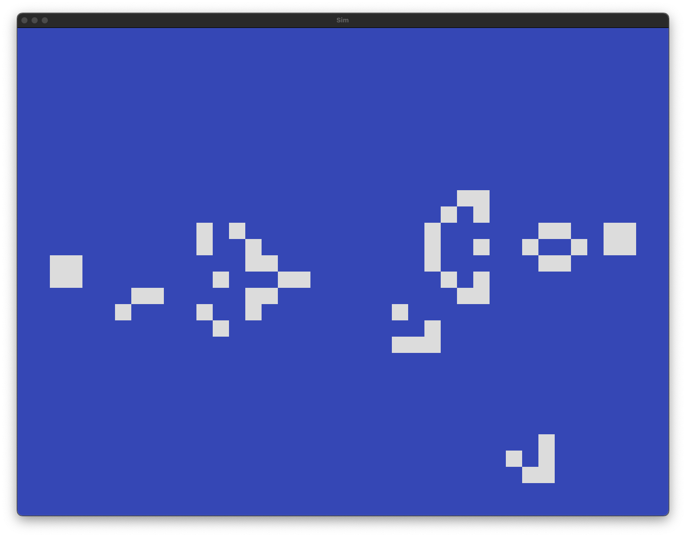

# yodl

Yet anOther (hardware) Description Language



## Quick links

- [Documentation](https://nathsou.github.io/yodl/book/)
- [Playground](https://nathsou.github.io/yodl/playground.html)

# Installation

## npm
The JS build of Yodl can be installed from npm:

```bash
$ npm install --global yodl
```

## wasm
A `WASI Preview 1` build of yodl is included in this repository:

```bash
wasmtime --dir examples res/yodl-wasi.wasm examples/RISCV.yodl "write_firrtl"
```

To compile FIRRTL outputs to SystemVerilog, install [firtool](https://github.com/llvm/circt/releases/tag/firtool-1.149.0)

## Usage
```bash
$ yodl examples/Hello.yodl "write_firrtl Hello.fir"
$ firtool --format=fir --verilog Hello.fir -o Hello.sv
```

## Development
Install [Moonbit](https://www.moonbitlang.com/):

```bash
$ curl -fsSL https://cli.moonbitlang.com/install/unix.sh | bash -s '0.9.3+08f337e2c'
```

## Checklist

- [x] [FIRRTL](https://github.com/chipsalliance/firrtl-spec) export
- [x] Generic multi-port memories
- [x] Imports (TODO: unqualified imports)
- [x] Verilator + SDL graphics simulation example
- [x] Multi-dimensional vectors ([4][8]u16)
- [ ] Optional module parameters (and register initial value)
- [x] Arbitrary port types
- [x] Type parameters
- [x] External modules
- [ ] Source Maps
- [ ] Test Benches
- [X] FIRRTL to RTLIL backend to bypass SystemVerilog generation
- [ ] Language Server Protocol (LSP) support
- [ ] [KiCad schematics](https://dev-docs.kicad.org/en/file-formats/sexpr-schematic/index.html) export
- [x] Web tour/playground
