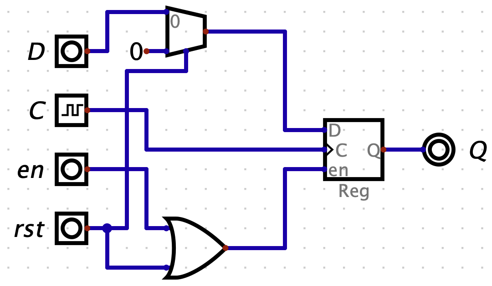

# yodl

Yet anOther (hardware) Description Language

## Goals
Automate schematic generation from a textual description.

## Pipeline
Circuit description (Yodl) -> Visualization (Digital) -> Software simulation (Yodl/Verilog simulator) -> FPGA synthesis (Yosys/Vivado, ...) -> Schematic & PCB (KiCad) -> Manufacturing (gerber)

- [ ] [Digital](https://github.com/hneemann/Digital) (with integrated component/wiring positioning editor?) export
- [ ] [RTLIL](https://yosyshq.readthedocs.io/projects/yosys/en/latest/yosys_internals/formats/rtlil_rep.html) Export
- [ ] RTLIL to KiCad schematic converter
- [ ] [KiCad schematics](https://dev-docs.kicad.org/en/file-formats/sexpr-schematic/index.html) export
- [ ] Built-in event-driven simulator?

## Syntax

```yodl
module RegWithReset<W> (
    clk: logic,
    rst: logic,
    data: logic[W],
    enable: logic,
) -> (
    q: logic[W],
) {
    let r = Reg<W>(
        clk: clk,
        data: if rst { '0 } else { data },
        enable: enable or rst,
    );

    q = r.q;
}

// built-in
declare module Reg1 (
    clk: logic,
    d: logic,
    enable: logic,
) -> (
    q: logic,
);

module Reg<W> (
    clk: logic,
    data: logic[W],
    enable: logic,
) -> (
    q: logic[W],
) {
    for i in 0..<W {
        let r = Reg1(
            clk: clk,
            d: data[i],
            enable: enable,
        );

        q[i] = r.q;
    }

    // q = [Reg1(clk, d: data[i], enable).q for i in 0..<W];
}
```

Should synthesise into a Digital circuit similar to:



## Checkpoints

- [ ] MVP: Manufacture a simple calculator circuit with a KiCad export

```yodl
module FullAdder(
    a: logic,
    b: logic,
    carry_in: logic,
) -> (
    sum: logic,
    carry_out: logic,
) {
    let xor1 = a xor b;
    sum = xor1 xor carry_in;
    carry_out = (carry_in and xor1) or (a and b);
}

module Adder<W>(
    a: logic[W],
    b: logic[W],
    carry_in: logic,
) -> (
    sum: logic[W],
    carry_out: logic,
) {
    let carry: logic[W];
    carry[0] = carry_in;

    repeat i in 0..<W {
        FullAdder(
            a: a[i],
            b: b[i],
            carry_in: carry[i],
            sum: sum[i],
            carry_out: carry[i + 1],
        );
    }

    carry_out = carry[W];
}
```
