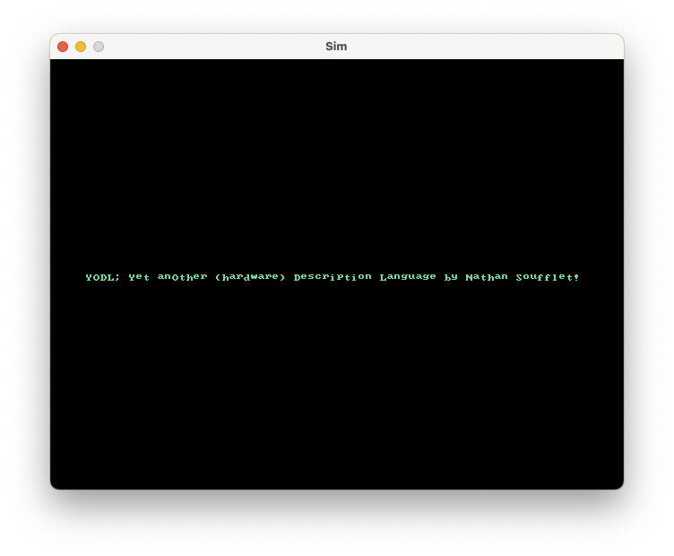

# yodl

Yet anOther (hardware) Description Language




## Usage
- Install [Moonbit](https://www.moonbitlang.com/)
- ```$ git clone https://github.com/nathsou/yodl.git yodl```
- ```$ cd yodl```
- ```$ moon run src/main examples/Hello.yodl "write_verilog Hello.v"```

## Checklist

- [x] [FIRRTL](https://github.com/chipsalliance/firrtl-spec) export
- [x] Generic multi-port memories
- [x] Imports (TODO: unqualified imports)
- [x] Verilator + SDL graphics simulation example
- [ ] Multi-dimensional vectors (uint<16>[4][8])
- [ ] Optional module parameters (and register initial value)
- [ ] Arbitrary port types
- [ ] Testbench generation (or use cocotb?)
- [ ] [KiCad schematics](https://dev-docs.kicad.org/en/file-formats/sexpr-schematic/index.html) export
- [ ] Web tour/playground
