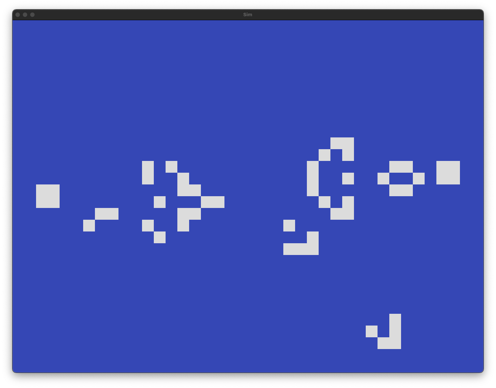

# yodl

Yet anOther (hardware) Description Language



## Quick links

- [Documentation](https://nathsou.github.io/yodl/book/)
- [Playground](https://nathsou.github.io/yodl/playground.html)

# Installation

## npm
The JS build of Yodl can be installed from npm:

```bash
$ npm install --global yodl
```

## wasm
A `WASI Preview 1` build of yodl is included in this repository:

```bash
wasmtime --dir examples res/yodl-wasi.wasm examples/RISCV.yodl "write_firrtl"
```

To compile FIRRTL outputs to SystemVerilog, install [firtool](https://github.com/llvm/circt/releases/tag/firtool-1.149.0)

## Usage
```bash
$ yodl examples/Hello.yodl "write_firrtl Hello.fir"
$ firtool --format=fir --verilog Hello.fir -o Hello.sv
```

## Editor support

The [VS Code extension](extensions/yodl-vscode-syntax/README.md) bundles the
MoonBit language server. It provides live diagnostics, completion, type hovers,
navigation through imports and builtins, references, rename, signature help,
symbols, semantic highlighting, folding, and quick fixes. Build an installable
VSIX with `bun run package` in `extensions/yodl-vscode-syntax`.

The playground offers the same features in a dedicated browser worker. Errors
appear while typing; compilation and simulation remain explicit actions. Use
F12 for definitions, Shift+F12 for references, F2 to rename, Ctrl/Cmd+Space for
completion, and Ctrl/Cmd+. for quick fixes. Imported sources open in tabs;
workspace edits made by rename are included in compilation and shared links.

For other LSP clients, `bun run build:lsp` produces `dist/lsp/yodl-lsp.cjs`.
Run it with Node over standard input/output using LSP `Content-Length` framing.
The npm package includes a `yodl-lsp` command when built from this source.
Editing requires no MoonBit installation or synthesis tools on the client.

The server, indexing, analysis and protocol handlers live in `src/lib/lsp`
and `src/lib/driver`. TypeScript supplies filesystem/stdio access and client
adapters. Both hosts use UTF-16 positions and overlay unsaved documents on
workspace files. Changes invalidate analysis; hosts debounce diagnostics.
The compiler's existing generic checks run when parameters become concrete.
Structural record fields have completion and navigation; field rename is
disabled because structural types do not give them a unique declaration.

Run `bun run test:lsp` for protocol, transport, worker and Monaco adapter checks
(the browser worker is also tested by `bun run test:docs`).

## Development
Install [Moonbit](https://www.moonbitlang.com/):

```bash
$ curl -fsSL https://cli.moonbitlang.com/install/unix.sh | bash -s '0.10.11+8f8e8db1e'
```

### Documentation, playground, and tour

The language guide, the guided tour, and the playground are three modes of one
page, `playground.html`, switched from the shared header. The [12-lesson
tour](tour/README.md) is separate from the larger designs under `examples/`:
start with a logic gate, then explore types, combinational logic, reusable
modules, registers, and memory. Each lesson offers an explanation, a suggested
compiler output to inspect, and a small experiment. Compile is the one primary
action; sharing, downloads, and reset live in the `···` menu. Output stages are
tabs, and an Output | Simulate switch opens the simulator with its inputs,
outputs, and waveform trace. Drafts are saved locally, and circuits can be
shared by link or downloaded. Theme (System, Light, Dark) and accent colour are
remembered.

With MoonBit, Bun **1.4.0**, and Python 3 installed, start the site:

```bash
bash scripts/serve-playground.sh
```

Open `http://localhost:8080/playground.html` (Tour), `?mode=examples`
(Playground), or `?mode=docs` (Docs). Existing `book/<chapter>.html` links forward
to the matching chapter. After editing Markdown, browser code, or tour content,
restart the script to rebuild, then reload the page. The site is self-contained: the editor (Monaco, added as a
development dependency and installed by the script with `bun install`), its
worker, and the fonts are bundled into `dist/`, so nothing is loaded from a CDN
and the deployed site works offline once served.

The book is built from Markdown using Bun's built-in parser and rendered inside
the page, sharing its themes and browser compiler. Its lightweight code blocks
include inferred type and builtin signature hovers, semantic highlighting, and
source diagnostics captured from the MoonBit language service at build time.
Hover or focus a symbol to inspect its type; errors are underlined and listed
below the code without needing to compile. Examples can also be compiled in
place and opened in the Playground for editing.
See [documentation authoring](book/README.md) for example metadata and validation.

Build the complete static site into `dist/` with `bun run build:site`.
GitHub Pages deployment uses this same build; no application server is required.

Validate the browser components and documentation with `bun run test:docs`.
Validate the tour and backend output with:

```bash
moon test src/lib/tests
bash scripts/test.sh
```

## Checklist

- [x] [FIRRTL](https://github.com/chipsalliance/firrtl-spec) export
- [x] Generic multi-port memories
- [x] Imports (TODO: unqualified imports)
- [x] Verilator + SDL graphics simulation example
- [x] Multi-dimensional vectors ([4][8]u16)
- [ ] Optional module parameters (and register initial value)
- [x] Arbitrary port types
- [x] Type parameters
- [x] External modules
- [ ] Source Maps
- [x] Test Benches
- [X] FIRRTL to RTLIL backend to bypass SystemVerilog generation
- [ ] Language Server Protocol (LSP) support
- [ ] [KiCad schematics](https://dev-docs.kicad.org/en/file-formats/sexpr-schematic/index.html) export
- [x] Web tour/playground
